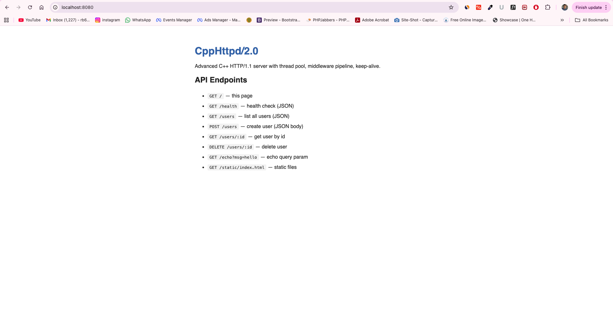
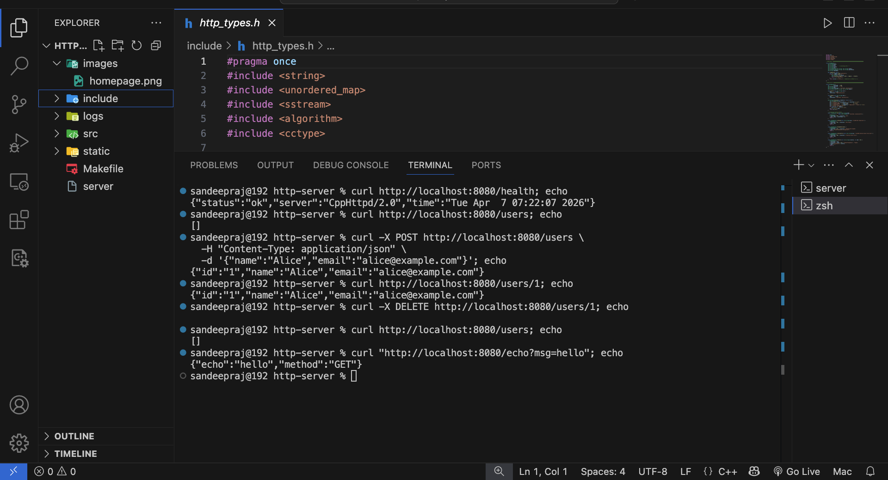
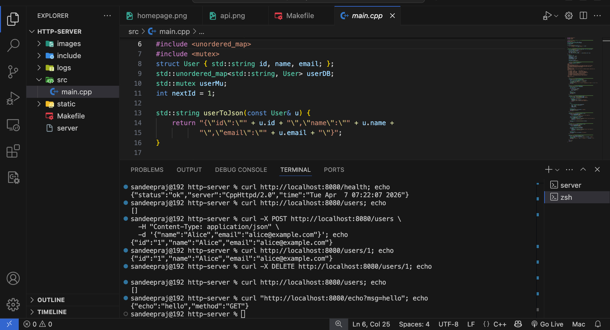

# 🚀 CppHttpd — Advanced HTTP/1.1 Server in C++

A high-performance, multithreaded HTTP/1.1 server built from scratch in modern C++. Designed with real-world backend concepts like routing, middleware, thread pooling, static file serving, and graceful shutdown.

---

## 📸 Homepage



---

## 📸 API Testing

```bash
curl http://localhost:8080/health
curl http://localhost:8080/users
curl -X POST http://localhost:8080/users \
  -H "Content-Type: application/json" \
  -d '{"name":"Alice","email":"alice@example.com"}'
curl http://localhost:8080/users/1
curl -X DELETE http://localhost:8080/users/1
curl "http://localhost:8080/echo?msg=hello"
```



---

## 📸 Project Structure



---

## ✨ Features

### ⚡ Core Features

* HTTP/1.1 server implementation using low-level socket programming
* Multithreaded architecture using a fixed-size thread pool
* Keep-Alive connection support for performance optimization
* Graceful shutdown handling (SIGINT / SIGTERM)

### 🧠 Backend Architecture

* Custom Router with dynamic route support (`/users/:id`)
* Middleware pipeline (inspired by Express.js / Gin)
* Modular and scalable project structure

### 🔌 Middleware Support

* Request logging (thread-safe logger)
* CORS handling
* Security headers:

  * `X-Frame-Options`
  * `X-Content-Type-Options`
  * `X-XSS-Protection`
* Rate limiting (per-IP sliding window)

### 📂 Static File Server

* Serves files from `/static` directory
* Automatic MIME type detection
* In-memory caching (reduces disk I/O)
* Directory fallback (`index.html`)

### 🔄 REST API Support

* `GET /health` → Health check
* `GET /users` → Get all users
* `POST /users` → Create user
* `GET /users/:id` → Get user by ID
* `DELETE /users/:id` → Delete user
* `GET /echo?msg=hello` → Query param echo

---

## 🛠️ System-Level Concepts Used

* Socket programming (`bind`, `listen`, `accept`)
* Multithreading (`std::thread`, `mutex`, `condition_variable`)
* Atomic operations
* File system operations (`std::filesystem`)
* Signal handling (`SIGINT`, `SIGTERM`, `SIGPIPE`)
* Memory-safe design (RAII principles)

---

## 📁 Project Structure

```
cpp-http-server/
├── src/
│   └── main.cpp
├── include/
│   ├── config.h
│   ├── logger.h
│   ├── thread_pool.h
│   ├── http_types.h
│   ├── http_parser.h
│   ├── router.h
│   ├── middleware.h
│   ├── connection_handler.h
│   ├── static_server.h
│   └── http_server.h
├── static/
│   └── index.html
├── screenshots/
├── Makefile
├── README.md
├── LICENSE
├── .gitignore
```

---

## ⚙️ Build & Run

### 🔧 Build

```bash
make
```

### ▶️ Run Server

```bash
./server
```

Server runs on:

```
http://localhost:8080
```

---

## 🧪 API Testing

### Health Check

```bash
curl http://localhost:8080/health
```

### Create User

```bash
curl -X POST http://localhost:8080/users \
  -H "Content-Type: application/json" \
  -d '{"name":"Alice","email":"alice@example.com"}'
```

### Get Users

```bash
curl http://localhost:8080/users
```

### Get User by ID

```bash
curl http://localhost:8080/users/1
```

### Delete User

```bash
curl -X DELETE http://localhost:8080/users/1
```

### Static Files

```bash
curl http://localhost:8080/static
```

---

## 🧠 How It Works

1. Client sends HTTP request
2. Server accepts connection and assigns it to thread pool
3. Request is parsed into structured format
4. Middleware pipeline processes request
5. Router matches endpoint
6. Handler or static server generates response
7. Response is sent back with keep-alive support

---

## 📊 Why This Project?

Unlike basic projects, this server implements real backend internals:

* No frameworks used
* Built completely from scratch
* Demonstrates understanding of system-level programming
* Covers real-world backend concepts used in production systems

---

## 🚀 Future Improvements

* HTTPS (SSL/TLS support)
* JSON parser integration
* Database support (MongoDB / SQLite)
* File upload handling
* Load balancing
* Performance benchmarking

---

## 👨‍💻 Author

**Sandeep Raj**
Aspiring Software Engineer | MERN + C++ Backend Developer

---

## ⭐ Show Your Support

If you like this project, consider giving it a ⭐ on GitHub!
ject, consider giving it a ⭐ on GitHub!
